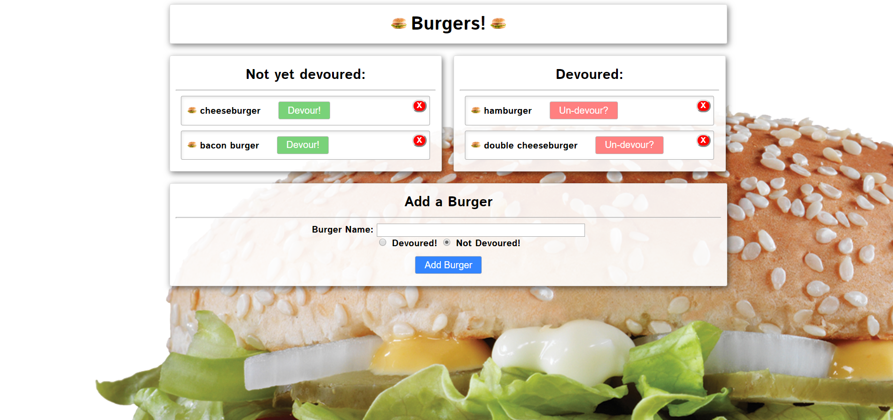

# eat-da-burger

## Description

eat-da-burger is a burger logger with MySQL, Node, Express, Handlebars. I used Node and MySQL to query and route data in the app, and Handlebars to generate your HTML.

Finished product

## Project created by

- Kondali Kangha

